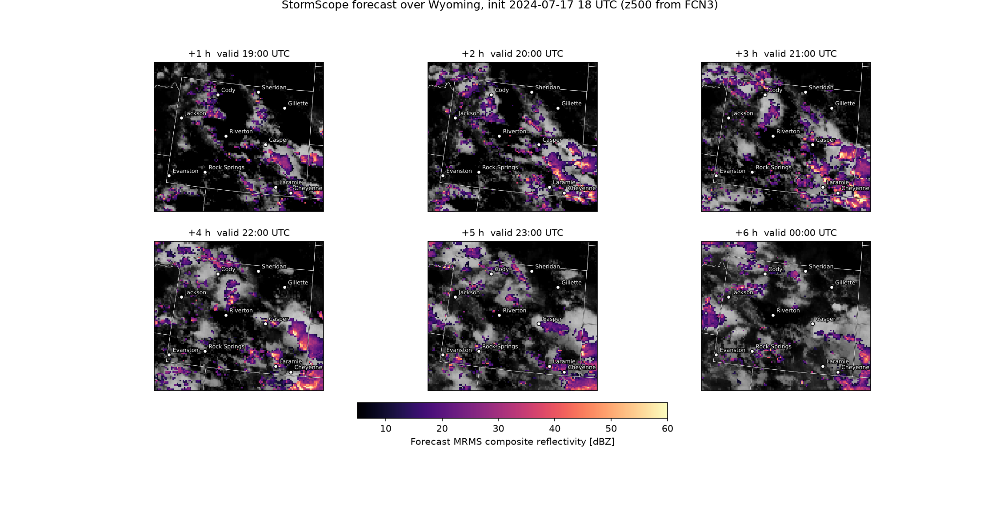
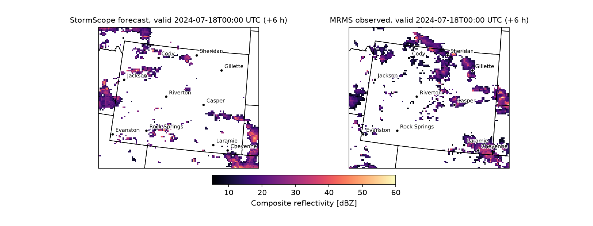
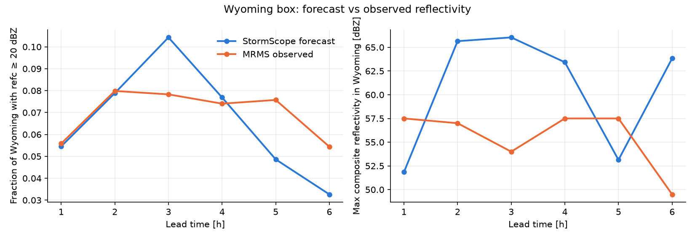
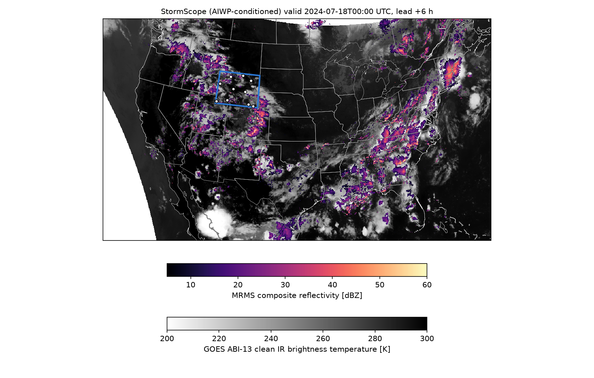
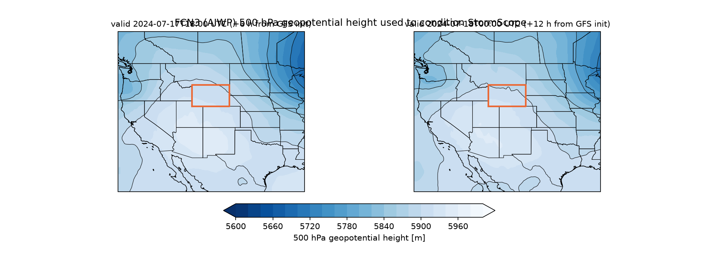

# Wyoming AI weather forecast

Notebooks that run NVIDIA Earth2Studio AI weather models and look at the result over Wyoming.

| Notebook | What it does |
|---|---|
| [`wyoming_ai_forecast.ipynb`](wyoming_ai_forecast.ipynb) | 5-day deterministic FourCastNet (FCN) forecast from GFS analysis, cropped to Wyoming. |
| [`aiwp_stormscope_wyoming.ipynb`](aiwp_stormscope_wyoming.ipynb) | FourCastNet 3 (hourly, via InterpModAFNO) providing `z500` conditioning to **StormScope** GOES + MRMS nowcasting on the CONUS grid, analysed and verified over Wyoming. Executed, with outputs embedded. |

## AIWP → StormScope over Wyoming

Pipeline: GFS analysis → FCN3 + surface-pressure diagnostic + InterpModAFNO (hourly `z500`) → StormScope GOES `6km_1hr` (conditioned on the AIWP `z500`) → StormScope MRMS `6km_1hr` (conditioned on the forecast GOES imagery) → Wyoming crop, verification against observed MRMS, NetCDF export.

Case: 2024-07-17, FCN3 init 12 UTC, StormScope init 18 UTC, six hourly steps. Major Wyoming towns (Cheyenne, Laramie, Casper, Gillette, Rock Springs, Sheridan, Jackson, Evanston, Riverton, Cody) are marked on the Wyoming maps.

Requirements: `earth2studio[fcn3,interp-modafno,stormscope,data]` (NATTEN with libnatten, torch-harmonics, makani), cartopy. `build_nb.py` regenerates the notebook source; `run_nb.sh` executes it headless with `jupyter nbconvert`.
